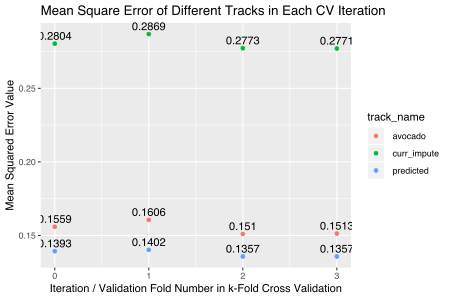
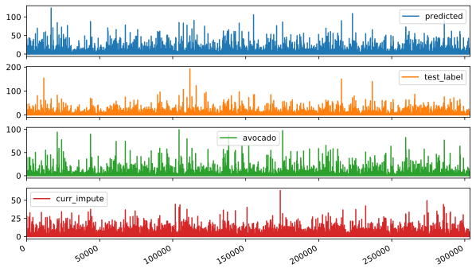
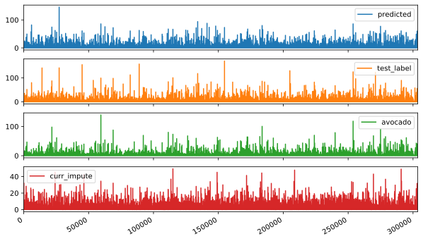
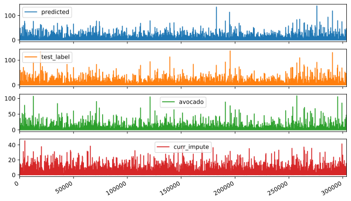
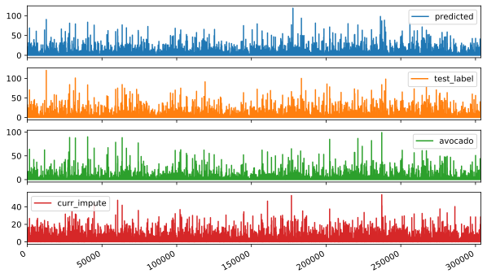

# Cross-Validation Training


```python
# Import necessary packages. 
import pandas as pd
import numpy as np 
import math
import time
from sklearn.ensemble import RandomForestRegressor
import matplotlib.pyplot as plt
import copy
```

## Data Preparation


```python
# Reading data.
ml_df = pd.read_csv("sources/ML_model/output/ml_data.csv", header=0)

# Create the shuffled dataframe for randomly selecting the folds. 
ml_df_shuf = ml_df.sample(frac=1)

# Define number of folds. 
k = 4

# Create index for the folds. 
folds_index = list(range(0, ml_df_shuf.shape[0], math.ceil(ml_df_shuf.shape[0]/k))) + [ml_df_shuf.shape[0]]
folds_index = [[folds_index[i]+1, folds_index[i+1]] for i in range(len(folds_index)-1)]
folds_index[0][0] = 0
folds_index
```


    [[0, 303615], [303616, 607230], [607231, 910845], [910846, 1214460]]


```python
# Creating label and feature dataset. 
label = ml_df_shuf["valid"].to_numpy()
features_orig = pd.get_dummies(ml_df_shuf.drop(columns=["valid"]))
features = features_orig.to_numpy() 
print(label[0:5])
print(features[0:5,:])
```

    [0.16390333 0.0377395  0.30630831 0.05606    0.11601658]
    [[0.14298705 0.20360121 0.         0.         0.         0.
      0.         0.         0.         0.         0.         0.
      1.         0.         0.         1.        ]
     [0.04412209 0.3374507  0.         0.         0.         0.
      0.         0.         0.         1.         0.         0.
      0.         1.         0.         0.        ]
     [0.46361867 0.23468205 0.         0.         0.         0.
      0.         0.         0.         0.         1.         0.
      0.         0.         1.         0.        ]
     [0.05444066 0.10581294 0.         0.         0.         0.
      0.         0.         0.         0.         0.         1.
      0.         0.         0.         1.        ]
     [0.20938928 0.45680226 0.         0.         0.         0.
      0.         0.         0.         1.         0.         0.
      0.         0.         1.         0.        ]]


## Cross-Validation Training


```python
def time_stamp(): 
    print("[{}]".format(time.time()))
```


```python
def cv_train(model_name, label, feature, folds): 
    predicted_set = {}
    iter_index = 0

    for validation_set in folds: 
        print("---- Creating Validation Set for data in range {}".format(validation_set))
        if model_name == "RF": 
            regr = RandomForestRegressor()
        else: 
            # Part for adding more models later. 
            print("#### Invalid Model Name. Terminating Training")
            break

        # Creating train and valid features, labels. 
        curr_test_feature = feature[validation_set[0]:validation_set[1],:]
        curr_test_label = label[validation_set[0]:validation_set[1]]
        curr_train_feature = np.delete(feature, np.s_[validation_set[0]:validation_set[1]+1], axis=0)
        curr_train_label = np.delete(label, np.s_[validation_set[0]:validation_set[1]+1], axis=0)

        start_time = time.time()
        print("-------- Start Training on {}".format(start_time))
        regr.fit(curr_train_feature, curr_train_label)
        print("-------- Finished Training, elapsed time: {}".format(time.time() - start_time))
        predicted_set[iter_index] = {
            "model": regr, 
            "predicted": regr.predict(curr_test_feature),
            "test_label": curr_test_label,
            "avocado": curr_test_feature[:,0],
            "curr_impute": curr_test_feature[:,1]
        }
        iter_index += 1

    return predicted_set
```


```python
def pretty(d, indent=0):
   for key, value in d.items():
      print('\t' * indent + str(key))
      if isinstance(value, dict):
         pretty(value, indent+1)
      else:
         print('\t' * (indent+1) + str(value))
```


```python
model_dic = cv_train("RF", label, features, folds_index)
```

    ---- Creating Validation Set for data in range [0, 303615]
    -------- Start Training on 1574142000.716201
    /Users/Michavillson/anaconda3/lib/python3.7/site-packages/sklearn/ensemble/forest.py:245: FutureWarning: The default value of n_estimators will change from 10 in version 0.20 to 100 in 0.22.
      "10 in version 0.20 to 100 in 0.22.", FutureWarning)
    -------- Finished Training, elapsed time: 63.56887698173523
    ---- Creating Validation Set for data in range [303616, 607230]
    -------- Start Training on 1574142066.1601129
    /Users/Michavillson/anaconda3/lib/python3.7/site-packages/sklearn/ensemble/forest.py:245: FutureWarning: The default value of n_estimators will change from 10 in version 0.20 to 100 in 0.22.
      "10 in version 0.20 to 100 in 0.22.", FutureWarning)
    -------- Finished Training, elapsed time: 57.79417419433594
    ---- Creating Validation Set for data in range [607231, 910845]
    -------- Start Training on 1574142125.823922
    /Users/Michavillson/anaconda3/lib/python3.7/site-packages/sklearn/ensemble/forest.py:245: FutureWarning: The default value of n_estimators will change from 10 in version 0.20 to 100 in 0.22.
      "10 in version 0.20 to 100 in 0.22.", FutureWarning)
    -------- Finished Training, elapsed time: 68.0430121421814
    ---- Creating Validation Set for data in range [910846, 1214460]
    -------- Start Training on 1574142195.726371
    /Users/Michavillson/anaconda3/lib/python3.7/site-packages/sklearn/ensemble/forest.py:245: FutureWarning: The default value of n_estimators will change from 10 in version 0.20 to 100 in 0.22.
      "10 in version 0.20 to 100 in 0.22.", FutureWarning)
    -------- Finished Training, elapsed time: 57.84371495246887


```python
# Calculating the MSE for each fold. 
MSE_dict = {}
for i in range(4): 
    MSE_dict[i] = {
        "predicted": round(np.mean(abs(model_dic[i]["predicted"]-model_dic[i]["test_label"])), 4), 
        "avocado": round(np.mean(abs(model_dic[i]["avocado"]-model_dic[i]["test_label"])), 4),
        "curr_impute": round(np.mean(abs(model_dic[i]["curr_impute"]-model_dic[i]["test_label"])), 4)
    }
pretty(MSE_dict)
```

    0
    	predicted
    		0.1393
    	avocado
    		0.1559
    	curr_impute
    		0.2804
    1
    	predicted
    		0.1402
    	avocado
    		0.1606
    	curr_impute
    		0.2869
    2
    	predicted
    		0.1357
    	avocado
    		0.151
    	curr_impute
    		0.2773
    3
    	predicted
    		0.1357
    	avocado
    		0.1513
    	curr_impute
    		0.2771



```python
# Pairwise Data Visualization. 
for i in range(4): 
    temp_dic = copy.deepcopy(model_dic[i])
    temp_dic.pop("model")
    temp_plot_df = pd.DataFrame(temp_dic)
    temp_plot_df.plot(subplots=True, figsize=(10, 6))
```














```python
# Plot the feature importance. 
feat_imp_li = model_dic[0]["model"].feature_importances_
feat_importance = pd.Series(feat_imp_li, index=features_orig.columns)
feat_importance.nlargest(6).plot(kind='barh')
# print(model_dic[0]["model"].feature_importances_)
```


    <matplotlib.axes._subplots.AxesSubplot at 0x1478e2550>


## Cross-Validated Training on Datasets Without IDEAS State


```python
print(features[0,:])
```

    [0.14298705 0.20360121 0.         0.         0.         0.
     1.         0.         0.         0.         0.         0.
     2.         0.         0.         1.        ]


```python
# Remove all IDEAS State dummies variable. 
features_id_rmd = features[:,0:2]
features_id_rmd[0,:]
```


    array([0.14298705, 0.20360121])


```python
model_dic_id_rmd = cv_train("RF", label, features_id_rmd, folds_index)
```

    ---- Creating Validation Set for data in range [0, 303615]
    -------- Start Training on 1574142733.138905
    /Users/Michavillson/anaconda3/lib/python3.7/site-packages/sklearn/ensemble/forest.py:245: FutureWarning: The default value of n_estimators will change from 10 in version 0.20 to 100 in 0.22.
      "10 in version 0.20 to 100 in 0.22.", FutureWarning)
    -------- Finished Training, elapsed time: 55.296984910964966
    ---- Creating Validation Set for data in range [303616, 607230]
    -------- Start Training on 1574142790.350058
    /Users/Michavillson/anaconda3/lib/python3.7/site-packages/sklearn/ensemble/forest.py:245: FutureWarning: The default value of n_estimators will change from 10 in version 0.20 to 100 in 0.22.
      "10 in version 0.20 to 100 in 0.22.", FutureWarning)
    -------- Finished Training, elapsed time: 45.43948006629944
    ---- Creating Validation Set for data in range [607231, 910845]
    -------- Start Training on 1574142837.659648
    /Users/Michavillson/anaconda3/lib/python3.7/site-packages/sklearn/ensemble/forest.py:245: FutureWarning: The default value of n_estimators will change from 10 in version 0.20 to 100 in 0.22.
      "10 in version 0.20 to 100 in 0.22.", FutureWarning)
    -------- Finished Training, elapsed time: 45.08976221084595
    ---- Creating Validation Set for data in range [910846, 1214460]
    -------- Start Training on 1574142885.53793
    /Users/Michavillson/anaconda3/lib/python3.7/site-packages/sklearn/ensemble/forest.py:245: FutureWarning: The default value of n_estimators will change from 10 in version 0.20 to 100 in 0.22.
      "10 in version 0.20 to 100 in 0.22.", FutureWarning)
    -------- Finished Training, elapsed time: 53.7148060798645


```python
# Calculating the MSE for each fold. 
MSE_dict = {}
for i in range(4): 
    MSE_dict[i] = {
        "predicted": round(np.mean(abs(model_dic_id_rmd[i]["predicted"]-model_dic_id_rmd[i]["test_label"])), 4), 
        "avocado": round(np.mean(abs(model_dic_id_rmd[i]["avocado"]-model_dic_id_rmd[i]["test_label"])), 4),
        "curr_impute": round(np.mean(abs(model_dic_id_rmd[i]["curr_impute"]-model_dic_id_rmd[i]["test_label"])), 4)
    }
pretty(MSE_dict)
```

    0
    	predicted
    		0.1748
    	avocado
    		0.1559
    	curr_impute
    		0.2804
    1
    	predicted
    		0.1766
    	avocado
    		0.1606
    	curr_impute
    		0.2869
    2
    	predicted
    		0.1703
    	avocado
    		0.151
    	curr_impute
    		0.2773
    3
    	predicted
    		0.1716
    	avocado
    		0.1513
    	curr_impute
    		0.2771


```python

```
